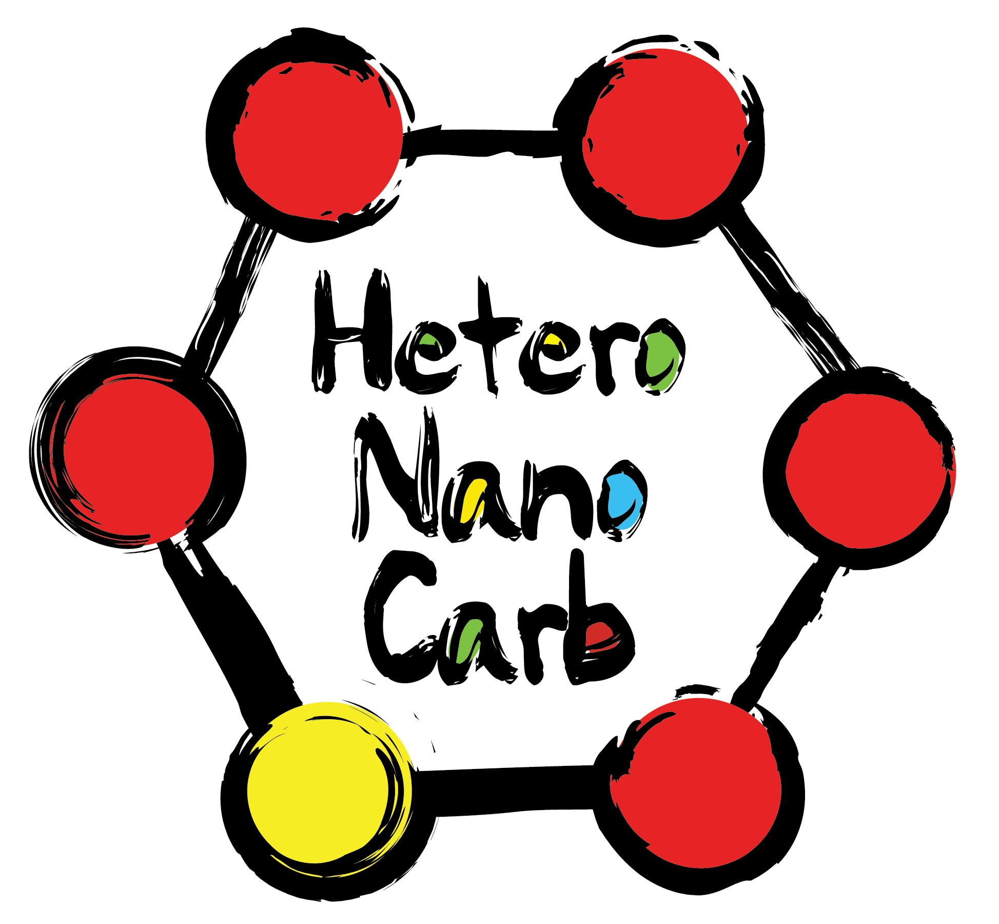

# HeteroNanoCarb

## https://heteronanocarb.org/

    

Website files for the HeteroNanoCarb website.

- Conference organiser: Raul Arenal
- Website built by Phil Ewels ([@ewels](https://github.com/ewels/)): <https://phil.ewels.co.uk>

## Web technologies

The site is built with static HTML + CSS. Not much has changed since the original 2013 edition.

The CSS framework used is [Foundation](https://get.foundation/).

## Archiving old sites

For each new iteration of the conference, the site files are copied into a subfolder to archive that year's website and the HTML updated for the next year.

## Holding page

To have a holding web page in place, rename:

- `index.html` to `index_site.html`
- `index_holding.html` to `index.html`

This lets you preview <https://heteronanocarb.org/index_site.html> as you build it but the website will show the holding page by default.

To go live, do the reverse.

## Deployment

Currently, the site is hosted on Phil's personal shared hosting. Files are uploaded manually via FTP.

Soon I hope to start using automated deployments onto GitHub Pages.
